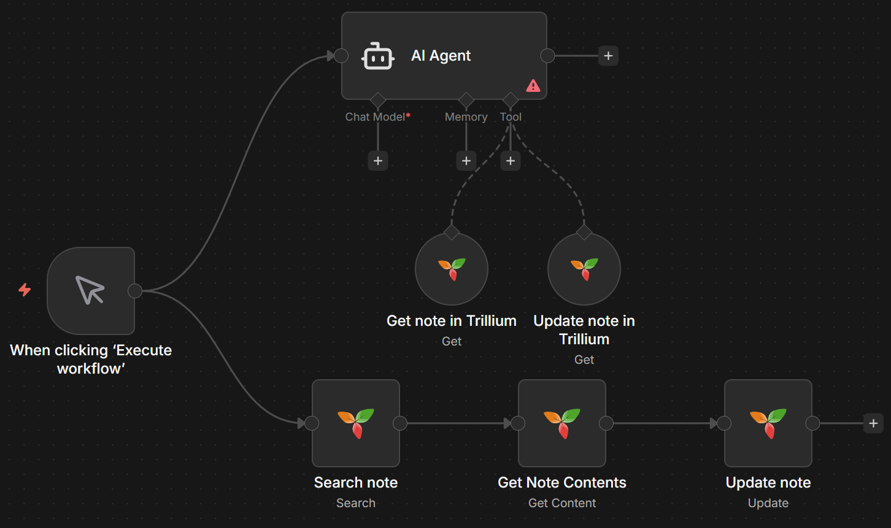

# n8n-nodes-trillium

A comprehensive n8n community node for integrating with Trillium Notes.



## Installation

Install via npm:

```bash
npm install n8n-nodes-trillium
```

Or install via n8n's community node interface.

## Features

- ✅ Full CRUD operations for notes, attributes, and relations (relations via attributes)
- ✅ Trillium Notes authentication support
- ✅ Declarative architecture for reliability
- ✅ Comprehensive testing included
- ✅ n8n Agents compatible

## Usage

### Basic Setup

1. Add the node to your n8n workflow
2. Configure your Trillium Notes credentials
3. Select the operation you want to perform

### Available Operations

#### Note Operations
- **Get**: Retrieve a note by ID
- **Create**: Create a new note
- **Update**: Update note metadata
- **Update Content**: Update note content
- **Get Content**: Get note content
- **Delete**: Delete a note
- **Get Children**: Get child notes
- **Search**: Search notes using query parameters
- **Export**: Export note with subnotes

#### Attribute Operations
- **Get**: Retrieve an attribute by ID
- **Create**: Create an attribute for a note
- **Update**: Update an attribute
- **Delete**: Delete an attribute

*Note: Relations between notes are managed as attributes with type "relation".*

### Configuration

#### Credentials

Set up your Trillium Notes API credentials:

- **Base URL**: Your Trillium instance URL (without /etapi)
- **Token**: ETAPI token from [Trillium Options > ETAPI](docs/img/etapi_token.png)

#### Node Parameters

- **Resource**: Select the resource to work with
- **Operation**: Choose the operation to perform
- **Additional Fields**: Configure operation-specific parameters

## Development

This node was built using the [n8n-community-node-starter](https://github.com/alejandrosnz/n8n-community-node-starter) boilerplate, which provides:

- Declarative node architecture
- Built-in CI/CD pipelines
- Comprehensive testing framework
- AI-assisted development support

### Contributing

1. Fork the repository
2. Create a feature branch
3. Make your changes with tests
4. Submit a pull request

## License

MIT License - see LICENSE file.

## Links

- [n8n Documentation](https://docs.n8n.io/)
- [Community Nodes Guide](https://docs.n8n.io/integrations/community-nodes/)
- [n8n-community-node-starter](https://github.com/alejandrosnz/n8n-community-node-starter) - The boilerplate this node is based on